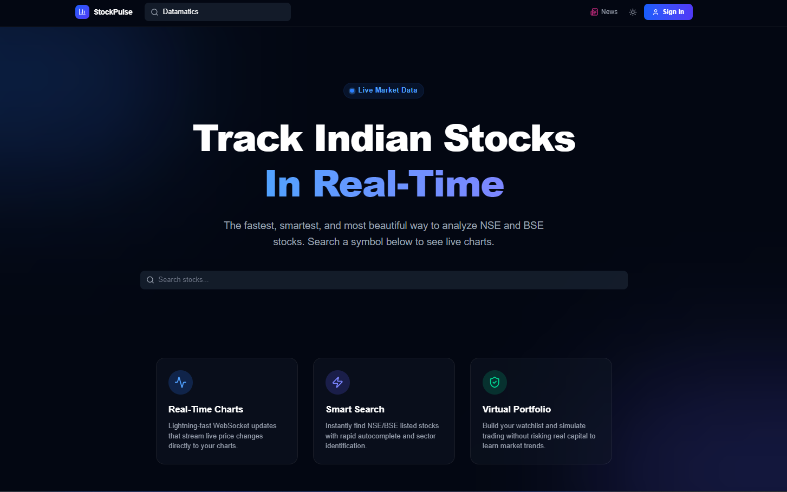
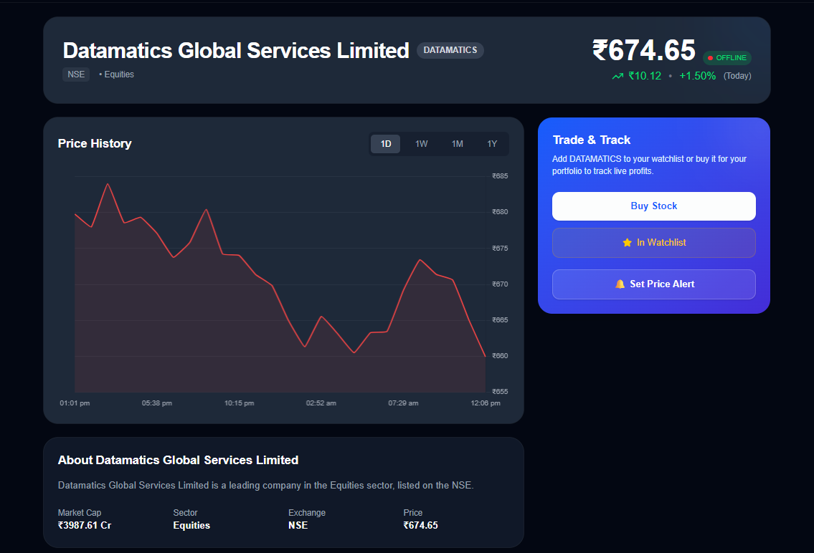
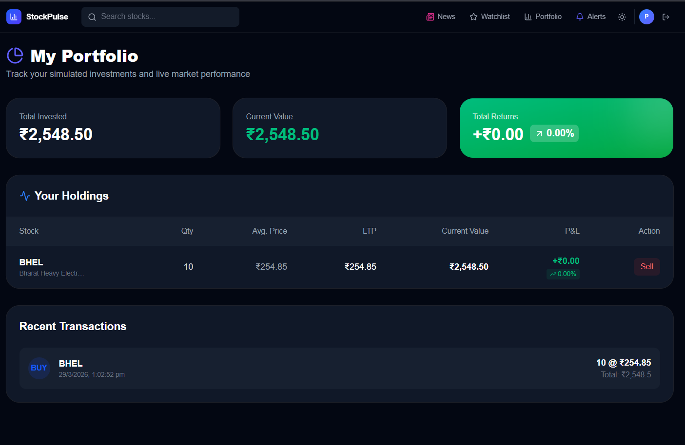
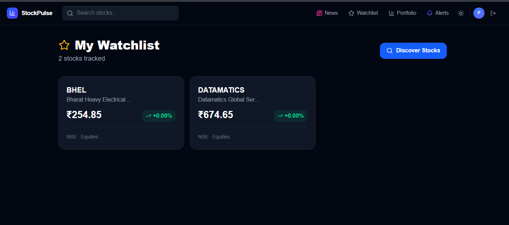
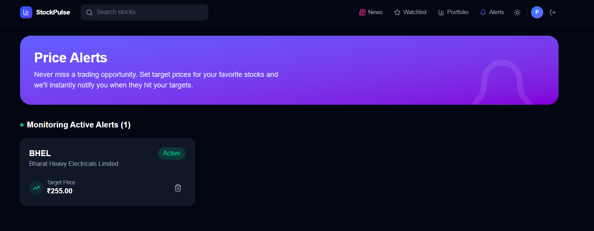
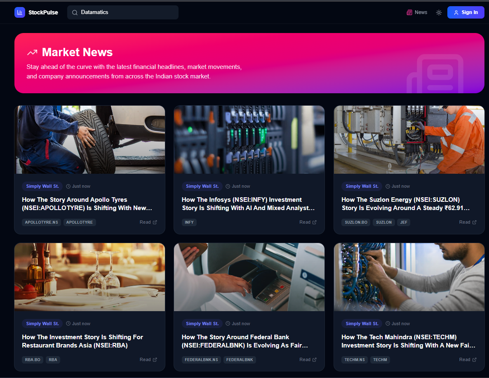

# 📊 StockPulse – Real-Time Indian Stock Analytics Platform

🚀 **Live Demo:** [https://stockpulse-market7.vercel.app/](https://stockpulse-market7.vercel.app/)

A full-stack platform for searching Indian stocks, viewing real-time charts, tracking portfolios, getting live news, and analyzing market trends.


<p align="center">
  
</p>

## 🖼️ Application Gallery

<details open>
<summary><b>Live Stock Dashboard & Charts</b></summary>

</details>

<details open>
<summary><b>Portfolio Tracking</b></summary>

</details>

<details>
<summary><b>Watchlists</b></summary>

</details>

<details>
<summary><b>Real-Time Price Alerts</b></summary>

</details>

<details>
<summary><b>Market News Feed</b></summary>

</details>

---

## ✨ Features

| Feature | Description |
|---------|-------------|
| 🔍 **Smart Stock Search** | Search NSE/BSE stocks with autocomplete |
| 📈 **Real-Time Charts** | Live candlestick charts (1D, 1W, 1M, 1Y) |
| ⭐ **Watchlist** | Add/remove stocks with real-time updates |
| 📰 **Live News** | Stock-specific & market news with sentiment |
| 💼 **Portfolio Tracker** | Track holdings, P/L, total value |
| 🔔 **Price Alerts** | Get notified when stocks hit target price |
| 🤖 **AI Insights** | Trend analysis & buy/sell suggestions |
| 📊 **Technical Indicators** | RSI, MACD, Moving averages |
| 🌐 **Market Heatmap** | Visual green/red grid of market |
| 🧠 **Sentiment Analysis** | News sentiment scoring |
| 🕒 **Market Status** | Open/closed/pre-market indicator |
| 🧪 **Backtesting** | Test strategies on historical data |

---

## 🧱 Tech Stack

### Frontend
- **Next.js 15** (App Router)
- **TypeScript**
- **Tailwind CSS**
- **Chart.js** + React-Chartjs-2
- **Socket.IO Client**

### Backend
- **Node.js** + **Express**
- **Socket.IO** (WebSocket)
- **Prisma ORM**
- **PostgreSQL**
- **Redis** (pub/sub)

### APIs
- Finnhub API
- Alpha Vantage
- NewsAPI

---

## 📁 Project Structure

```
Sharemarket/
├── client/                 # Next.js Frontend
│   ├── src/
│   │   ├── app/           # App router pages
│   │   ├── components/    # UI components
│   │   ├── lib/           # Utilities & API helpers
│   │   ├── hooks/         # Custom React hooks
│   │   ├── types/         # TypeScript interfaces
│   │   └── context/       # React context providers
│   └── package.json
│
├── server/                 # Node.js Backend
│   ├── src/
│   │   ├── config/        # DB, Redis, Socket config
│   │   ├── controllers/   # Route handlers
│   │   ├── middleware/     # Auth, error handling
│   │   ├── routes/        # API routes
│   │   ├── services/      # Business logic & API integrations
│   │   ├── sockets/       # WebSocket handlers
│   │   ├── types/         # TypeScript interfaces
│   │   ├── utils/         # Helper functions
│   │   └── index.ts       # Server entry point
│   ├── prisma/
│   │   └── schema.prisma  # Database schema
│   └── package.json
│
├── .gitignore
└── README.md
```

---

## 🚀 Getting Started

### Prerequisites

- **Node.js** v18+
- **PostgreSQL** running locally or remote
- **Redis** running locally or remote
- API keys for Finnhub / Alpha Vantage / NewsAPI

### 1. Clone the repo

```bash
git clone https://github.com/YOUR_USERNAME/stockpulse.git
cd stockpulse
```

### 2. Backend Setup

```bash
cd server
npm install

# Configure environment
cp .env.example .env
# Edit .env with your credentials

# Generate Prisma client
npx prisma generate

# Run database migrations
npx prisma migrate dev --name init

# Start dev server
npm run dev
```

Server starts at `http://localhost:5000`

### 3. Frontend Setup

```bash
cd client
npm install

# Start dev server
npm run dev
```

App opens at `http://localhost:3000`

---

## 📡 API Endpoints

| Method | Endpoint | Description |
|--------|----------|-------------|
| `GET` | `/api/stocks/search?q=` | Search stocks |
| `GET` | `/api/stocks/:symbol` | Get stock details |
| `GET` | `/api/stocks/top-gainers` | Top gainers |
| `GET` | `/api/stocks/top-losers` | Top losers |
| `POST` | `/api/users/register` | Register user |
| `POST` | `/api/users/login` | Login |
| `GET` | `/api/watchlist` | Get watchlist |
| `POST` | `/api/watchlist` | Add to watchlist |
| `DELETE` | `/api/watchlist/:stockId` | Remove from watchlist |
| `GET` | `/api/portfolio` | Get portfolio with P/L |
| `POST` | `/api/portfolio/holdings` | Add holding |
| `GET` | `/api/portfolio/transactions` | Transaction history |
| `GET` | `/api/alerts` | Get alerts |
| `POST` | `/api/alerts` | Create alert |
| `PATCH` | `/api/alerts/:id/toggle` | Toggle alert |
| `GET` | `/api/news` | Get news |
| `GET` | `/api/news/market` | Market news |
| `GET` | `/api/market/status` | Market open/close status |

---

## ⚡ WebSocket Events

| Event | Direction | Description |
|-------|-----------|-------------|
| `subscribe:stock` | Client → Server | Subscribe to stock updates |
| `unsubscribe:stock` | Client → Server | Unsubscribe |
| `subscribe:user` | Client → Server | Subscribe to user alerts |
| `subscribe:market` | Client → Server | Subscribe to market status |
| `stock_price_update` | Server → Client | Live price update |
| `watchlist_update` | Server → Client | Watchlist change |
| `alert_triggered` | Server → Client | Alert notification |
| `market_status_change` | Server → Client | Market opens/closes |

---

## 🗄️ Database Models

- **User** – Authentication & profile
- **Stock** – NSE/BSE stock data
- **Watchlist** – User's watched stocks
- **Portfolio** – User's holdings with avg price
- **Transaction** – Buy/sell history
- **Alert** – Price target notifications
- **News** – Stock & market news with sentiment

---

## 🛠️ Available Scripts

### Backend (`server/`)

| Command | Description |
|---------|-------------|
| `npm run dev` | Start with hot reload |
| `npm run build` | Compile TypeScript |
| `npm start` | Run production build |
| `npm run prisma:generate` | Generate Prisma client |
| `npm run prisma:migrate` | Run DB migrations |
| `npm run prisma:studio` | Open Prisma Studio |

### Frontend (`client/`)

| Command | Description |
|---------|-------------|
| `npm run dev` | Dev server (port 3000) |
| `npm run build` | Production build |
| `npm start` | Serve production build |

---

## 📜 License

MIT

---

**Built with ❤️ for the Indian Stock Market**
